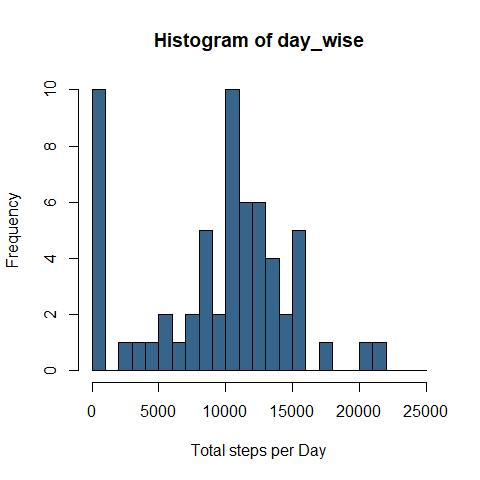
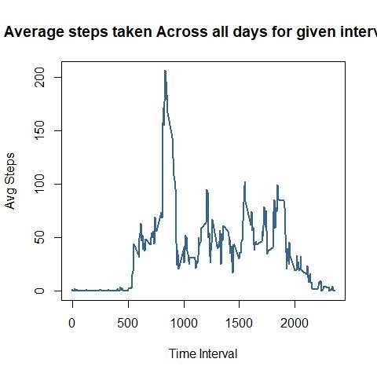

### Introduction

It is now possible to collect a large amount of data about personal
movement using activity monitoring devices such as a Fitbit, Nike
Fuelband, or Jawbone Up. These type of devices are part of the
“quantified self” movement – a group of enthusiasts who take
measurements about themselves regularly to improve their health, to find
patterns in their behavior, or because they are tech geeks. But these
data remain under-utilized both because the raw data are hard to obtain
and there is a lack of statistical methods and software for processing
and interpreting the data.

This project makes use of data from a personal activity monitoring
device. This device collects data at 5 minute intervals through out the
day. The data consists of two months of data from an anonymous
individual collected during the months of October and November, 2012 and
include the number of steps taken in 5 minute intervals each day.

The data used in this project can be downloaded from
[here](https://d396qusza40orc.cloudfront.net/repdata%2Fdata%2Factivity.zip)

#### Dataset Overview

The variables included in this dataset are:

-   **steps**: Number of steps taking in a 5-minute interval (missing
    values are coded as NA)
-   **date**: The date on which the measurement was taken in YYYY-MM-DD
    format
-   **interval**: Identifier for the 5-minute interval in which
    measurement was taken

The dataset is stored in a comma-separated-value (CSV) file and there
are a total of 17,568 observations in this dataset.

### Reading Data and Pre-Processing

Setting the global options for the document.

    knitr::opts_chunk$set(warning=FALSE, message = FALSE)

Loading the required library for plotting.

    library(ggplot2)

Reading the CSV file into a dataframe names activity.

    activity <- read.csv("~/R Projects/Fitbit-Activity-Analysis/Data/activity.csv", stringsAsFactors=FALSE)
    head(activity)

    ##   steps       date interval
    ## 1    NA 2012-10-01        0
    ## 2    NA 2012-10-01        5
    ## 3    NA 2012-10-01       10
    ## 4    NA 2012-10-01       15
    ## 5    NA 2012-10-01       20
    ## 6    NA 2012-10-01       25

As we can see steps column does have some missing values, we will be
dealing with them later and then comparing our outputs with and without
missing values.

exploring the dataframe,

    str(activity)

    ## 'data.frame':    17568 obs. of  3 variables:
    ##  $ steps   : int  NA NA NA NA NA NA NA NA NA NA ...
    ##  $ date    : chr  "2012-10-01" "2012-10-01" "2012-10-01" "2012-10-01" ...
    ##  $ interval: int  0 5 10 15 20 25 30 35 40 45 ...

We have to now convert the date column type to date instead of character
before proceeding.

    activity$date <- as.Date(activity$date, format = "%Y-%m-%d")

We will now try to analyse and try to answer few questions.

### What is mean total number of steps taken per day?

To answer the question we will analyse total steps taken per day. We do
that by summing the steps for every single date available to us.

    day_wise <- tapply(activity$steps, activity$date, sum, na.rm=TRUE)
    head(day_wise)

    ## 2012-10-01 2012-10-02 2012-10-03 2012-10-04 2012-10-05 2012-10-06 
    ##          0        126      11352      12116      13294      15420

Now we plot a Histogram to analyse frequency of total steps per day.

    hist(day_wise, xlab = "Total steps per Day", breaks = seq(0,25000, by=1000), col="steelblue4")

Clearly from the plot we can see we have many days with 0 total steps
which can be the result of missing value too. Apart from that major
distribution is between 10,000 to 15,000 steps most being between
10,000-11,000 which was the total for 10 seperate days.

We can now compute the mean and median of total steps per day.

    mean(day_wise)

    ## [1] 9354.23

    median(day_wise)

    ## [1] 10395

This is considered to be a very healthy amount.

### What is the average daily activity pattern?

We will compute the average number of steps taken per interval (0 to
2355) during the day.

    interval_wise <- tapply(activity$step, activity$interval, mean, na.rm=TRUE)

We will now plot the values obtained to take a closer look at the
patterns.

    plot(unique(activity$interval) ,interval_wise, type="l", ylab = "Avg Steps", 
         xlab = "Time Interval", main = "Average steps taken Across all days for given intervals", 
         col="steelblue4", lwd= 2)

There is no activity after midnight to 5am which would be the period
when subject would be asleep. There is decent average steps from 10 am
to 8pm which are the working hours and slowly drissle out when it is
time to relax. The maximum activity happen somewhere between 8-10am
which would be the time to specifically workout.

There is a very obvious peak, let us find out the time interval at which
is happens.

    interval_wise[which.max(interval_wise)]

    ##      835 
    ## 206.1698

8:35- 8:40 am is when subject takes the most number of steps.

### Imputing missing values

Finally as discussed earlier we will impute the missing values and then
alltogther see the changes and effect of missing data.

First we will see the number of missing values we are dealing with.

    logv <- sapply(activity, is.na)
    colSums(as.data.frame(colSums(logv)))

    ## colSums(logv) 
    ##          2304

So we have 2304 intervals which have no steps recorded.

**Imputing formula:** We will be using the average number of steps in a
given interval to impute value for steps missing in that interval.

Now we will create a new dataframe activity\_imputed which we contain
the imputed data.

    interval_df <- aggregate(activity$steps, by=list(activity$interval), FUN=mean, na.rm=TRUE)
    names(interval_df) <- c("interval", "mean")
    imputed_steps <- interval_df$mean[match(activity$interval, interval_df$interval)]
    activity_imputed <- transform(activity, steps = ifelse(is.na(activity$steps), 
                        yes = imputed_steps, no = activity$steps))

Now we will redo the Analysis that we did while answering the first
question and figure out the difference in results thus obtained.

    day_wise_imputed <- tapply(activity_imputed$steps, activity_imputed$date, sum, na.rm=TRUE)
    hist(day_wise_imputed, xlab = "Total steps per Day", breaks = seq(0,25000, by=1000), col="steelblue4", ylim = c(0,20))

    mean(day_wise_imputed)

    ## [1] 10766.19

    median(day_wise_imputed)

    ## [1] 10766.19

-   Firstly we observe that the domination interval of 0 total steps has
    shrunk due to us eliminating missing values.
-   While mesian is in the same ballpark as original, mean has had a
    significant increase due to additional values.
-   Mean and Median has coincided, which shows the distribution of total
    steps is somewhat of a normal distribution.

### Are there differences in activity patterns between weekdays and weekends?

To do this, we have to first figure out which are the weekdays and which
are the weekends. We will be adding a column to our imputed data frame
which will denote which day it is one of the two.

    activity_imputed <- transform(activity_imputed, day = ifelse(weekdays(date) %in% c("Sunday","Saturday"), yes = "Weekend", no = "Weekday"))
    head(activity_imputed)

    ##       steps       date interval     day
    ## 1 1.7169811 2012-10-01        0 Weekday
    ## 2 0.3396226 2012-10-01        5 Weekday
    ## 3 0.1320755 2012-10-01       10 Weekday
    ## 4 0.1509434 2012-10-01       15 Weekday
    ## 5 0.0754717 2012-10-01       20 Weekday
    ## 6 2.0943396 2012-10-01       25 Weekday

Now finally we will plot interval wise average number of steps for both
weekdays and weekends and the compare the result.

    activity_by_date <- aggregate(steps~interval + day, activity_imputed, mean, na.rm = TRUE)

    ggplot(activity_by_date, aes(x = interval , y = steps, color = day)) + geom_line() + labs(title = "Average daily steps by type of date", x = "Interval", y = "Average number of steps") + facet_wrap(~day, ncol = 1, nrow=2)

Due to obvious reasons, The activity for Weekend is spread out
theroughout the day insted of a specific workout period due to the
absense of having to work. Also the activity is delayed in the mornign
due to a delayed wake up time for the days of holidays.
